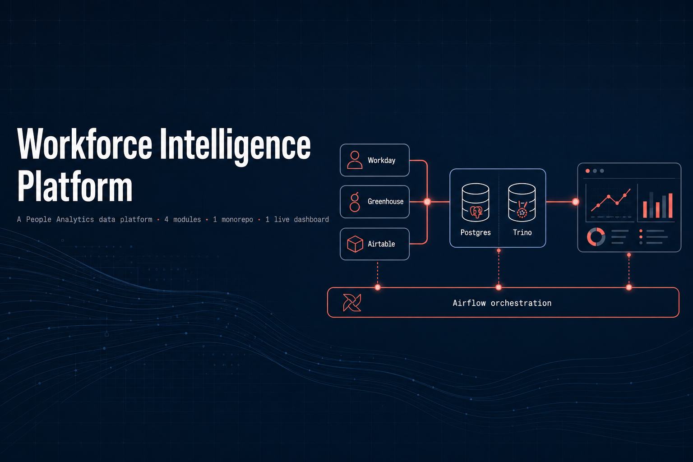

# workforce-intelligence-platform

A reference architecture for People Analytics data infrastructure, built as a portfolio
demonstrating production-grade data engineering for modern HR + AI use cases.

In plain terms: this platform pulls scattered HR data (employee records, hiring,
spreadsheets) into one trustworthy place, then turns it into clear answers about
headcount, attrition, and recruiting — with privacy controls and a simple dashboard on top.

## Platform overview

Four independently deployable modules that share a common Postgres/Trino data layer and
a unified Airflow orchestration spine. Each module maps to a specific capability Airbnb's
People Analytics team needs.

```
external sources (Workday · Greenhouse · Airtable · SFTP)
         │
         ▼
┌─────────────────────────────────────────────────────┐
│  ingestion/          HR ingestion pipeline           │
│  Python connectors · Postgres staging · dbt models  │
└──────────────────────────┬──────────────────────────┘
                           │
         ┌─────────────────┼──────────────────┐
         ▼                 ▼                  ▼
  shared data layer    llm-eval/         governance/
  Postgres (OLTP)      LLM eval infra    PII tagging
  Trino   (OLAP)       pgvector · RAGAS  access control
         │                 │                  │
         └─────────────────┼──────────────────┘
                           │
                           ▼
                      dashboard/
                      Streamlit app
                      deployed: Streamlit Cloud
                           │
                           ▼
         ┌─────────────────────────────────────┐
         │  Airflow orchestration spine         │
         │  4 DAG groups · sensors · alerting  │
         └─────────────────────────────────────┘
```

## Modules

| Module | Purpose | Key technologies | Gaps closed |
|---|---|---|---|
| `ingestion/` | HR source connectors, Postgres staging, dbt models | Python, Postgres, Trino, dbt, Airflow | Trino/Postgres, Python API ingestion |
| `llm-eval/` | LLM eval harness, pgvector embeddings, feedback loop | pgvector, RAGAS, sentence-transformers, Airflow | LLM data infra |
| `governance/` | PII classification, column masking, audit logging | YAML config, Postgres DDL codegen, Airflow | Sensitive data governance |
| `dashboard/` | Streamlit People Analytics app, Trino queries | Streamlit, Trino, Plotly, Airflow | Data products / Streamlit |

## Repository structure

This is an umbrella ("monorepo") repository: each module is its own standalone Git
repository, pulled in here as a Git **submodule**. The shared Docker Compose at the root
spins up the common infrastructure (Postgres, Trino, Airflow) that all modules depend on.

```
workforce-intelligence-platform/        ← umbrella repo
├── README.md
├── TASKS.md                    ← master build plan (start here)
├── docker-compose.yml          ← shared infra: Postgres, Trino, Airflow
├── .env.example
├── Makefile                    ← top-level orchestration targets
├── .gitmodules                 ← submodule -> remote mapping
├── 1-ingestion/    → submodule: github.com/exclusivearj/workforce-intelligence-platform-ingestion
├── 2-llm-eval/     → submodule: github.com/exclusivearj/workforce-intelligence-platform-llm-eval
├── 3-governance/   → submodule: github.com/exclusivearj/workforce-intelligence-platform-governance
├── 4-dashboard/    → submodule: github.com/exclusivearj/workforce-intelligence-platform-dashboard
└── 0-linkedin-articles/
```

Submodule directories keep their numbered prefixes to convey the required build order;
the shared `docker-compose.yml`, root `Makefile`, and CI workflows all reference these
numbered paths. Each submodule is versioned independently and pinned here at a specific
commit — updating a module is an explicit pointer commit in this umbrella repo.

### Cloning

```bash
# clone the umbrella plus all four module submodules in one step
git clone --recurse-submodules https://github.com/exclusivearj/workforce-intelligence-platform.git

# or, if you already cloned without --recurse-submodules:
git submodule update --init --recursive
```

## Prerequisites

- Docker Desktop ≥ 4.x
- Python 3.11+
- `make`

## Quick start

```bash
cp .env.example .env          # fill in API keys
make infra-up                 # start Postgres + Trino + Airflow
make ingestion-setup          # create schemas, roles, seed data
make test-all                 # run all project test suites
```

## Build sequence

Projects must be built in order — each depends on the shared data layer established by `ingestion/`.

1. `ingestion/` — establishes the shared Postgres/Trino layer
2. `llm-eval/` — adds pgvector to the shared Postgres instance
3. `governance/` — adds audit tables and access control DDL on top of existing schemas
4. `dashboard/` — reads from Trino; all upstream data must exist

See `TASKS.md` for the week-by-week implementation plan.

## LinkedIn article series

See `0-linkedin-articles/` for the companion writing:

- `00-intro.md` — series introduction
- `01-ingestion.md` — HR ingestion pipeline deep dive
- `02-llm-eval.md` — LLM evaluation infrastructure
- `03-governance.md` — sensitive data governance
- `04-dashboard.md` — Streamlit People Analytics dashboard
